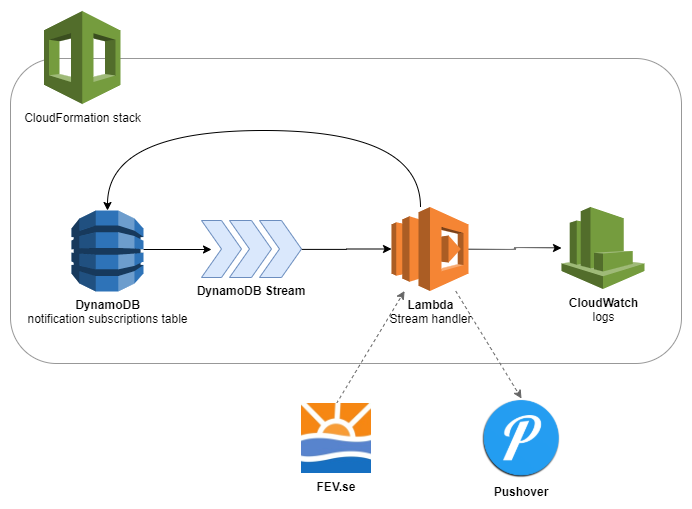

# FEV Sophämtning pushnotification

A service for automatically checking when the next [FEV garbage pickup](https://fev.se/atervinning/sophamtning.html) is due and sending a notification through [Pushover](https://pushover.net/) the day before.

## Installation & Deployment

Copy `.example.env` to `.env`. Modify as you see fit.

Search-replace `irish-luck` in `MakeFile` with the name of your S3 bucket.

```bash
make deploy
```

Add a record into the new `${PROJECT}-pickups-${ENVIRONMENT}` table:

```js
{
  addressQuery: "lumsheden 75", // A query that will only return a single result
  pushoverUser: "my user token"
}
```

You should receive a confirmation notification shortly:


## Architecture


